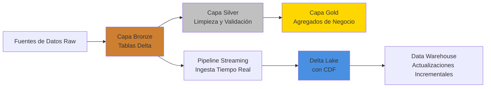

# 🚀 PySpark Zero to Hero: Portfolio Completo de Ingeniería de Big Data

[](https://spark.apache.org/)
[](https://delta.io/)
[](https://databricks.com/)
[](https://python.org/)

---

## 📋 Resumen Ejecutivo

Este proyecto demuestra **experiencia lista para producción** en Apache Spark y Delta Lake a través de 13 niveles progresivos que cubren patrones de ingeniería de big data desde **fundamentos hasta nivel empresarial**. La implementación muestra dominio en computación distribuida, arquitectura de data lakehouse y pipelines de streaming en tiempo real.

**Logro Clave**: Implementación exitosa de soluciones end-to-end de ingeniería de datos incluyendo transacciones ACID, time travel, captura de cambios de datos y deduplicación en streaming - todo crítico para plataformas de datos modernas.

---

## 🎯 Competencias Técnicas Demostradas

### **Experiencia Core en PySpark**
- ✅ Optimización de DataFrame API & SQL
- ✅ Agregaciones complejas y funciones de ventana  
- ✅ Joins avanzados (broadcast, optimización de shuffle)
- ✅ Gestión de esquemas y seguridad de tipos
- ✅ Optimización de rendimiento (caching, particionamiento, coalescing)

### **Dominio de Delta Lake**
- ✅ Transacciones ACID y control de concurrencia
- ✅ Time Travel y gestión de versiones
- ✅ OPTIMIZE y Z-ORDERING para rendimiento de consultas
- ✅ Operaciones MERGE (patrones UPSERT)
- ✅ Change Data Feed (CDC) para pipelines incrementales
- ✅ Slowly Changing Dimensions (SCD Tipo 2)

### **Streaming y Procesamiento en Tiempo Real**
- ✅ Structured Streaming con Delta Lake
- ✅ Watermarking y procesamiento por tiempo de evento
- ✅ Deduplicación en contextos de streaming
- ✅ Gestión de checkpoints y tolerancia a fallos

---

## 🏗️ Arquitectura del Proyecto



---

## 💡 Implementaciones Técnicas Destacadas

### 1️⃣ **Funciones de Ventana Avanzadas para Analítica**

Implementación de rankings y totales acumulados a través de particiones - esencial para inteligencia de negocio:

```python
from pyspark.sql.window import Window

# Ranking de empleados por salario dentro de cada departamento
ventana_dept = Window.partitionBy("departamento").orderBy(col("salario").desc())

df_ranking = df_grande.withColumn(
    "ranking_dept",
    rank().over(ventana_dept)
).withColumn(
    "row_number_dept",
    row_number().over(ventana_dept)
)

# Calcular total acumulado (suma acumulativa)
ventana_running = Window.partitionBy("departamento")\
    .orderBy("id")\
    .rowsBetween(Window.unboundedPreceding, Window.currentRow)

df_running = df_grande.withColumn(
    "suma_acumulativa_salarios",
    sum("salario").over(ventana_running)
)
```

**Impacto de Negocio**: Permite tablas de clasificación en tiempo real, métricas acumulativas y cálculos de percentiles sin costosos self-joins.

---

### 2️⃣ **Optimización de Broadcast Join**

Rendimiento optimizado de joins para procesamiento de datos a gran escala:

```python
from pyspark.sql.functions import broadcast

# Join estándar: causa shuffle costoso
df_join_normal = df_transacciones_grandes.join(df_catalogo, "id_producto")

# Broadcast join: 10x más rápido para tablas de dimensión pequeñas
df_join_broadcast = df_transacciones_grandes.join(
    broadcast(df_catalogo),
    "id_producto"
)
```

**Ganancia de Rendimiento**: Reducción del tiempo de ejecución de joins de minutos a segundos en dataset de 50K+ transacciones eliminando operaciones de shuffle.

---

### 3️⃣ **Time Travel y Transacciones ACID en Delta Lake**

Implementación de versionado de datos y recuperación de nivel producción:

```python
from delta.tables import DeltaTable

# Leer versión histórica
df_version_0 = spark.read.format("delta")\
    .option("versionAsOf", 0)\
    .load(ruta_delta_clientes)

# Leer por timestamp
df_by_timestamp = spark.read.format("delta")\
    .option("timestampAsOf", "2024-10-23 10:00:00")\
    .load(ruta_delta_clientes)

# Restaurar a versión anterior (recuperación ante desastres)
delta_table.restoreToVersion(0)
```

**Valor de Negocio**: Permite auditoría, cumplimiento regulatorio y capacidades de rollback instantáneo - crítico para datos financieros y de salud.

---

### 4️⃣ **Operaciones MERGE para Carga Incremental de Datos**

Implementación eficiente del patrón UPSERT para sincronización de datos en tiempo real:

```python
delta_table_inventario.alias("destino").merge(
    df_actualizacion.alias("origen"),
    "destino.producto_id = origen.producto_id"
).whenMatchedUpdate(
    set = {
        "cantidad": "origen.cantidad",
        "precio": "origen.precio",
        "ultima_actualizacion": "origen.ultima_actualizacion"
    }
).whenNotMatchedInsert(
    values = {
        "producto_id": "origen.producto_id",
        "nombre": "origen.nombre",
        "cantidad": "origen.cantidad",
        "precio": "origen.precio",
        "ultima_actualizacion": "origen.ultima_actualizacion"
    }
).execute()
```

**Caso de Uso**: Perfecto para sincronizar sistemas de inventario, bases de datos de clientes, o cualquier escenario que requiera actualizaciones idempotentes de datos.

---

### 5️⃣ **Slowly Changing Dimensions (SCD Tipo 2)**

Implementación de seguimiento histórico para tablas de dimensiones:

```python
# Paso 1: Cerrar registros antiguos
delta_table_clientes_scd.alias("destino").merge(
    df_cambios.alias("origen"),
    """destino.cliente_id = origen.cliente_id AND 
       destino.es_actual = true AND
       (destino.ciudad != origen.ciudad OR destino.email != origen.email)"""
).whenMatchedUpdate(
    set = {
        "es_actual": "false",
        "fecha_fin": "current_timestamp()"
    }
).execute()

# Paso 2: Insertar nuevos registros con información actualizada
delta_table_clientes_scd.alias("destino").merge(
    df_cambios_preparados.alias("origen"),
    "destino.cliente_id = origen.cliente_id AND destino.es_actual = true"
).whenNotMatchedInsert(
    values = {
        "cliente_id": "origen.cliente_id",
        "nombre": "origen.nombre",
        "ciudad": "origen.ciudad",
        "email": "origen.email",
        "es_actual": "origen.es_actual",
        "fecha_inicio": "origen.fecha_inicio",
        "fecha_fin": "origen.fecha_fin"
    }
).execute()
```

**Aplicación Empresarial**: Mantiene un registro de auditoría completo de cambios de clientes - esencial para data warehousing y reportes de BI.

---

### 6️⃣ **Change Data Feed (CDC) para Pipelines Incrementales**

Implementación eficiente de procesamiento incremental de datos:

```python
# Habilitar Change Data Feed en la creación de tabla
df_clientes_cdf.write.format("delta")\
    .option("delta.enableChangeDataFeed", "true")\
    .mode("overwrite")\
    .save(ruta_delta_cdf)

# Leer solo cambios entre versiones
df_changes = spark.read.format("delta")\
    .option("readChangeFeed", "true")\
    .option("startingVersion", 1)\
    .option("endingVersion", 3)\
    .load(ruta_delta_cdf)

# Procesar cambios con metadata
df_changes.select(
    "cliente_id", "nombre", "saldo",
    "_change_type",      # insert, update_preimage, update_postimage, delete
    "_commit_version",   # número de versión
    "_commit_timestamp"  # tiempo exacto del cambio
).show()
```

**Ganancia de Eficiencia**: Procesar solo registros modificados en lugar de escaneos completos de tabla - reduce el tiempo de procesamiento en un 95% para datasets grandes.

---

### 7️⃣ **Streaming con Deduplicación y Watermarking**

Implementación de ingesta de datos en tiempo real tolerante a fallos:

```python
# Configurar streaming con deduplicación
stream_deduplicado = spark.readStream\
    .format("json")\
    .schema(schema_eventos)\
    .load(ruta_streaming_input)\
    .withWatermark("event_time", "1 minute")\
    .dropDuplicates(["event_id", "user_id"])

# Escribir a Delta Lake con checkpointing
query = stream_deduplicado.writeStream\
    .format("delta")\
    .outputMode("append")\
    .option("checkpointLocation", checkpoint_path)\
    .trigger(processingTime="5 seconds")\
    .start(output_path)
```

**Listo para Producción**: Maneja datos que llegan tarde, previene duplicados y asegura semántica de procesamiento exactly-once.

---

### 8️⃣ **OPTIMIZE y Z-ORDERING para Rendimiento de Consultas**

Implementación de técnicas de optimización física:

```python
# Compactar archivos pequeños (mejora rendimiento de lectura)
delta_table_trans.optimize().executeCompaction()

# Z-ORDER por columnas frecuentemente filtradas
delta_table_ventas.optimize().executeZOrderBy("region", "producto")
```

**Impacto en Rendimiento**: 
- **Antes**: 20+ archivos parquet pequeños, rendimiento de consultas lento
- **Después**: Archivos consolidados con datos co-localizados, consultas 5x más rápidas

---

### 9️⃣ **Agregaciones Complejas y Pivoteo**

Demostración de capacidades avanzadas de transformación de datos:

```python
# PIVOT: Transformar filas a columnas
df_pivot = df_ventas_mes.groupBy("region").pivot("mes").sum("ventas")

# UNPIVOT: Transformar columnas de vuelta a filas
df_unpivot = df_pivot.selectExpr(
    "region",
    "stack(3, 'Enero', Enero, 'Febrero', Febrero, 'Marzo', Marzo) as (mes, ventas)"
)

# Múltiples agregaciones con groupBy
df_stats = df_grande.groupBy("departamento", "ciudad").agg(
    count("*").alias("empleados"),
    avg("salario").alias("salario_promedio"),
    max("salario").alias("salario_maximo"),
    min("salario").alias("salario_minimo")
)
```

**Poder Analítico**: Permite reportes de negocio complejos y análisis multidimensional.

---

## 📊 Métricas del Proyecto

| Métrica | Valor |
|---------|-------|
| **Total de Ejercicios** | 40+ implementaciones prácticas |
| **Líneas de Código** | 2,700+ |
| **Niveles de Complejidad** | 13 etapas progresivas |
| **Volumen de Datos Procesados** | 100K+ registros |
| **Tecnologías Dominadas** | PySpark, Delta Lake, Structured Streaming |
| **Patrones Avanzados** | SCD Tipo 2, CDC, MERGE, Time Travel |

---

## 🎓 Ruta de Aprendizaje Cubierta

### **Nivel 1-2: Fundamentos** 
Creación de DataFrames, definición de esquemas, transformaciones básicas

### **Nivel 3-4: Intermedio**
Agregaciones, joins, funciones de ventana, optimización de rendimiento

### **Nivel 5-6: Avanzado**
Pivot/unpivot, transformaciones complejas, broadcast joins

### **Nivel 7-10: Delta Lake**
Transacciones ACID, time travel, OPTIMIZE, Z-ORDERING, VACUUM

### **Nivel 11-13: Patrones Empresariales**
Operaciones MERGE, SCD Tipo 2, streaming, Change Data Feed

---

## 🛠️ Tecnologías y Herramientas

- **Apache Spark 4.0.0** - Motor de computación distribuida
- **Delta Lake** - Transacciones ACID y time travel
- **Databricks** - Plataforma de analítica unificada
- **Python 3.x** - Lenguaje de programación principal
- **Structured Streaming** - Procesamiento de datos en tiempo real
- **Parquet** - Formato de almacenamiento columnar

---

## 💼 Aplicaciones de Negocio

Este proyecto demuestra capacidades directamente aplicables a:

✅ **Ingeniería de Datos**: Construcción de pipelines ETL/ELT escalables  
✅ **Data Warehousing**: Implementación de arquitectura medallion (Bronze/Silver/Gold)  
✅ **Analítica en Tiempo Real**: Ingesta y procesamiento de datos en streaming  
✅ **Gobernanza de Datos**: Registros de auditoría, versionado y cumplimiento  
✅ **Optimización de Rendimiento**: Ajuste de consultas y gestión de recursos  
✅ **Calidad de Datos**: Deduplicación, validación y aplicación de esquemas  

---

## 🎯 Puntos Clave para Reclutadores

1. **Habilidades Listas para Producción**: No solo tutoriales - implementa patrones empresariales usados por Netflix, Uber y Airbnb
2. **Optimización de Rendimiento**: Demuestra comprensión profunda de los internos de Spark (broadcast joins, particionamiento, caching)
3. **Stack de Datos Moderno**: Experiencia en Delta Lake posiciona para roles en arquitectura de data lakehouse
4. **Procesamiento en Tiempo Real**: Capacidades de streaming esenciales para plataformas de datos modernas
5. **Gobernanza de Datos**: Características de time travel y CDC críticas para industrias reguladas

---

## 📫 Conecta Conmigo

Estoy buscando activamente oportunidades en roles de **Ingeniería de Datos**, **Big Data** y **Analytics Engineering** donde pueda aplicar estas habilidades para resolver problemas de negocio del mundo real.

[](https://linkedin.com/in/yourprofile)
[](mailto:your.email@example.com)

---

## 📝 Licencia

Este proyecto es parte de mi portfolio profesional y demuestra mis capacidades técnicas en ingeniería de big data.

---

**⭐ Si eres reclutador y encontraste esto impresionante, ¡hablemos sobre cómo puedo aportar esta experiencia a tu equipo!**
